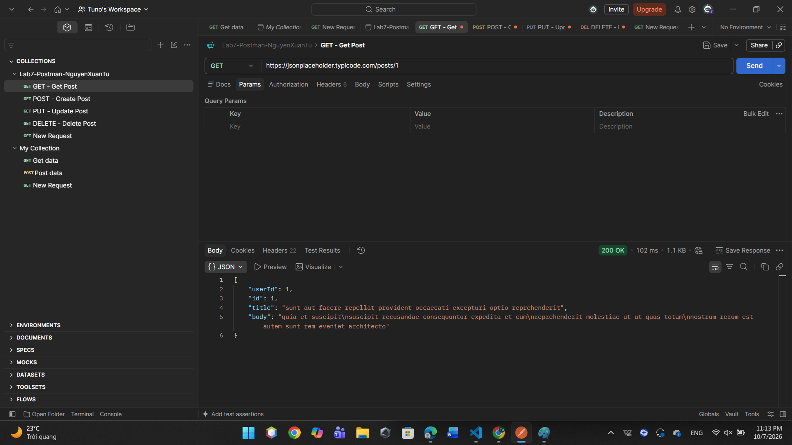
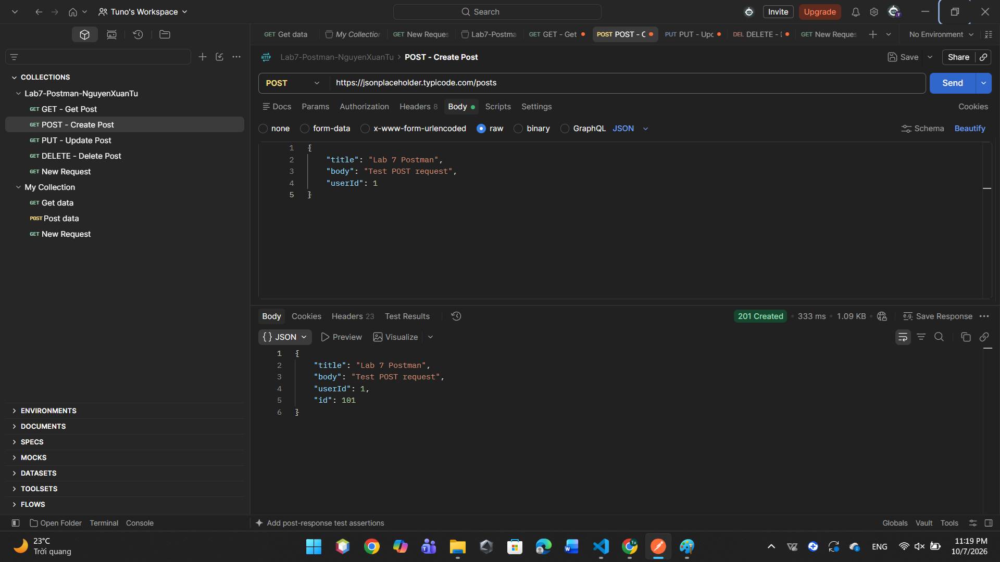
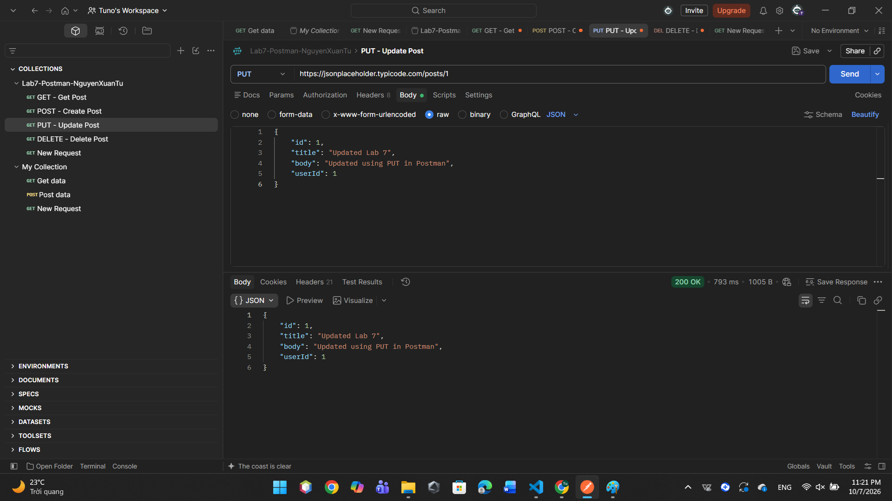
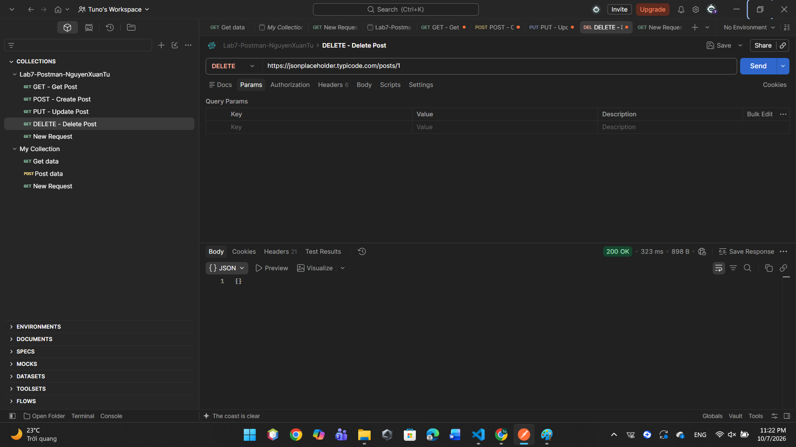

LAB 7 - POSTMAN

1. Thông tin sinh viên

- Họ và tên: Nguyễn Xuân Tú
- Bài thực hành: Lab 7
- Nội dung: API Testing with Postman

2. Mục tiêu

- Làm quen với công cụ Postman.
- Biết cách gửi HTTP Request.
- Thực hành các phương thức GET, POST, PUT và DELETE.
- Kiểm tra Response của API.
- Thực hiện kiểm thử API cơ bản.

3. Công cụ sử dụng

- Postman
- GitHub
- JSONPlaceholder API

## 4. Thực hành GET

### 4.1. Mục đích

Phương thức GET được sử dụng để lấy dữ liệu từ API.

### 4.2. Request

GET https://jsonplaceholder.typicode.com/posts/1

### 4.3. Thực hiện

Trong Postman, chọn phương thức GET, nhập URL và nhấn Send để gửi request.

### 4.4. Kết quả

API trả về thông tin của bài viết có ID là 1.

---

## 5. Thực hành POST

### 5.1. Mục đích

Phương thức POST được sử dụng để gửi dữ liệu lên API và tạo một tài nguyên mới.

### 5.2. Request

POST https://jsonplaceholder.typicode.com/posts

### 5.3. Request Body

Chọn Body, sau đó chọn raw và JSON.

Dữ liệu gửi lên:

    {
        "title": "Lab 7 Postman",
        "body": "Test POST request",
        "userId": 1
    }

### 5.4. Thực hiện

Trong Postman:

1. Chọn phương thức POST.
2. Nhập URL.
3. Chọn Body.
4. Chọn raw.
5. Chọn JSON.
6. Nhập dữ liệu.
7. Nhấn Send.
8. Kiểm tra Response.

### 5.5. Kết quả

API trả về dữ liệu của tài nguyên được tạo.

---

## 6. Thực hành PUT

### 6.1. Mục đích

Phương thức PUT được sử dụng để cập nhật dữ liệu của một tài nguyên.

### 6.2. Request

PUT https://jsonplaceholder.typicode.com/posts/1

### 6.3. Request Body

Chọn Body, sau đó chọn raw và JSON.

Dữ liệu gửi lên:

    {
        "id": 1,
        "title": "Updated Lab 7",
        "body": "Updated using PUT in Postman",
        "userId": 1
    }

### 6.4. Thực hiện

Trong Postman:

1. Chọn phương thức PUT.
2. Nhập URL.
3. Chọn Body.
4. Chọn raw.
5. Chọn JSON.
6. Nhập dữ liệu.
7. Nhấn Send.
8. Kiểm tra Response.

### 6.5. Kết quả

API trả về thông tin bài viết sau khi cập nhật.

---

## 7. Thực hành DELETE

### 7.1. Mục đích

Phương thức DELETE được sử dụng để gửi yêu cầu xóa một tài nguyên.

### 7.2. Request

DELETE https://jsonplaceholder.typicode.com/posts/1

### 7.3. Thực hiện

Trong Postman:

1. Chọn phương thức DELETE.
2. Nhập URL.
3. Không cần nhập Request Body.
4. Nhấn Send.
5. Kiểm tra Response.

### 7.4. Kết quả

Request DELETE được gửi thành công đến API.

---

## 8. Tổng hợp kết quả

| STT | Phương thức | Chức năng | Kết quả |
|---|---|---|---|
| 1 | GET | Lấy dữ liệu | Thành công |
| 2 | POST | Tạo dữ liệu | Thành công |
| 3 | PUT | Cập nhật dữ liệu | Thành công |
| 4 | DELETE | Xóa dữ liệu | Thành công |

---

## 9. Kiến thức đạt được

Sau bài thực hành, em đã biết:

- Sử dụng công cụ Postman.
- Tạo và gửi HTTP Request.
- Sử dụng GET để lấy dữ liệu.
- Sử dụng POST để tạo dữ liệu.
- Sử dụng PUT để cập nhật dữ liệu.
- Sử dụng DELETE để gửi yêu cầu xóa dữ liệu.
- Truyền dữ liệu JSON trong Request Body.
- Kiểm tra Response từ API.

---

## 10. Kết luận

Sau khi hoàn thành Lab 7, em đã làm quen và thực hành được các chức năng cơ bản của công cụ Postman.

Em đã thực hiện các phương thức HTTP cơ bản gồm GET, POST, PUT và DELETE trên JSONPlaceholder API.

Qua bài thực hành, em hiểu được quy trình cơ bản của việc kiểm thử API: tạo Request, gửi Request, nhận Response và kiểm tra kết quả.

Bài thực hành giúp em có thêm kiến thức và kỹ năng cơ bản trong việc sử dụng Postman để kiểm thử API.

Em đã thực hiện thành công bốn phương thức HTTP cơ bản gồm GET, POST, PUT và DELETE trên JSONPlaceholder API.

Qua bài thực hành, em hiểu được quy trình cơ bản của việc kiểm thử API: tạo Request, gửi Request, nhận Response và kiểm tra kết quả.

Bài thực hành giúp em có thêm kiến thức và kỹ năng cơ bản trong việc sử dụng Postman để kiểm thử API trong quá trình phát triển và kiểm thử phần mềm.
